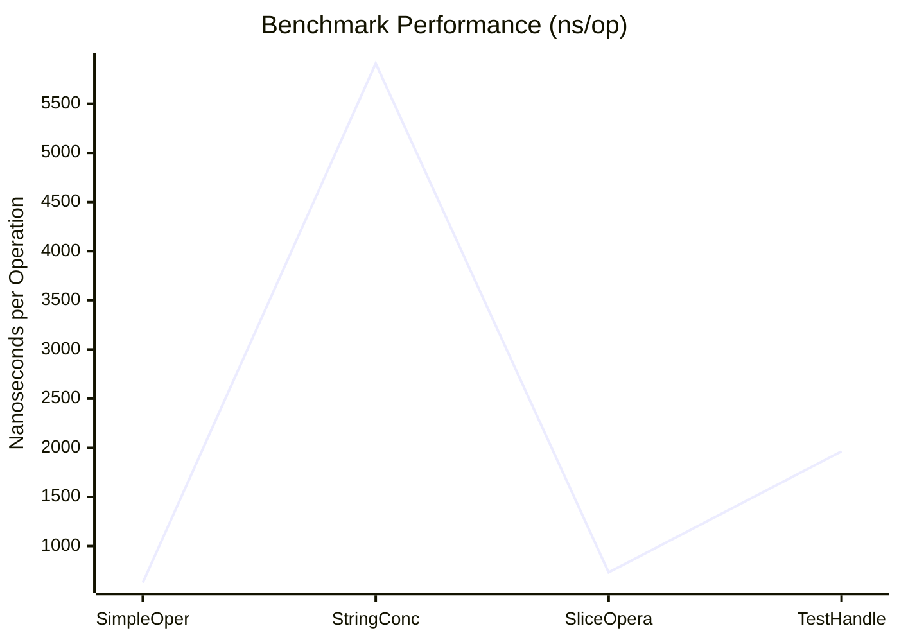

# 🔧 benchzribe

A command-line tool for parsing, visualizing, and managing Go benchmark results. Automatically updates your README with beautifully formatted benchmark results and provides visualization options.

## ✨ Features

- 📊 Parse Go benchmark results and generate formatted tables
- 📝 Automatically update README with benchmark results
- 📈 Generate interactive visualizations of benchmark data
- ⏱️ Track performance changes over time
- 🔄 Easy integration with CI/CD pipelines

## 📦 Installation

```bash
go install github.com/kitd3k/benchzribe@latest
```

## 🚀 Usage

1. Run your Go benchmarks and save the output:
```bash
go test -bench . -benchmem ./... > bench.out
```

2. Update README with benchmark results:
```bash
benchzribe run
```

3. Generate interactive performance graphs:
```bash
benchzribe graph
```

## 📊 Benchmark Results

<!-- BENCHSCRIBE:START -->
### 📊 Benchmark Results

| Benchmark | ns/op | B/op | allocs/op |
|-----------|-------|------|------------|
| SimpleOperation-4 | 628 | 0 | 0 |
| StringConcatenation-4 | 5910 | 21080 | 99 |
| SliceOperations-4 | 732 | 0 | 0 |
| TestHandler-4 | 1964 | 5747 | 18 |

### 📈 Performance Visualization



### 📊 Performance Overview

```
Performance Overview:
====================

SimpleOperation-4         ns/op: ██▁▁▁▁▁▁▁▁▁▁▁▁▁▁▁▁▁▁ (628)
                          B/op:  ▁▁▁▁▁▁▁▁▁▁▁▁▁▁▁▁▁▁▁▁ (0)
                          alloc: ▁▁▁▁▁▁▁▁▁▁▁▁▁▁▁▁▁▁▁▁ (0)

StringConcatenation-4     ns/op: ████████████████████ (5910)
                          B/op:  ████████████████████ (21080)
                          alloc: ████████████████████ (99)

SliceOperations-4         ns/op: ██▁▁▁▁▁▁▁▁▁▁▁▁▁▁▁▁▁▁ (732)
                          B/op:  ▁▁▁▁▁▁▁▁▁▁▁▁▁▁▁▁▁▁▁▁ (0)
                          alloc: ▁▁▁▁▁▁▁▁▁▁▁▁▁▁▁▁▁▁▁▁ (0)

TestHandler-4             ns/op: ██████▁▁▁▁▁▁▁▁▁▁▁▁▁▁ (1964)
                          B/op:  █████▁▁▁▁▁▁▁▁▁▁▁▁▁▁▁ (5747)
                          alloc: ███▁▁▁▁▁▁▁▁▁▁▁▁▁▁▁▁▁ (18)

```

_Last updated: Fri, 27 Jun 2025 01:18:28 UTC_

<!-- BENCHSCRIBE:END -->

## 🛠️ Commands

- `benchzribe run` - Parse benchmark results and update README
- `benchzribe graph` - Generate interactive performance visualization
- `benchzribe readme` - Manually update README section

## 🤝 Contributing

Contributions are welcome! Please feel free to submit a Pull Request.

## 📄 License

This project is licensed under the MIT License - see the LICENSE file for details.
